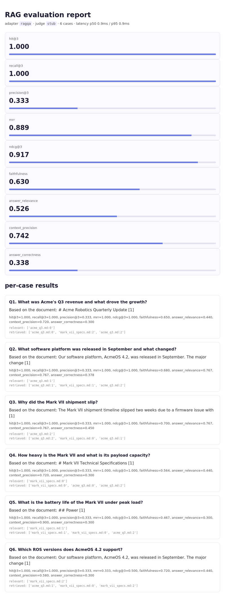

# rag-eval

a lightweight framework for measuring how good a RAG system actually is. retrieval metrics, LLM-as-judge quality metrics, latency, and HTML reports. point it at any RAG system through a small adapter interface.



## why this exists

building a RAG system is the easy half. knowing whether it works is the hard half. most people ship a retriever, eyeball a few answers, and call it done. this framework puts numbers on it. did the retriever surface the right chunks, is the answer grounded in the context or hallucinated, does it actually address the question, how much of the retrieved context was noise.

it grew out of [rag-document-qa](https://github.com/jashkaransingh/rag-document-qa). once that system worked, the next question was how well, and there was no clean way to answer it. so I built the thing that answers it.

## what it measures

**retrieval metrics** (need ground-truth relevant chunk ids)

| metric | what it tells you |
|--------|-------------------|
| hit@k | did the right chunk show up in the top k at all |
| recall@k | what fraction of all relevant chunks were retrieved |
| precision@k | what fraction of the top k were actually relevant |
| mrr | how high the first relevant chunk ranked |
| ndcg@k | how well the ranking ordered relevant chunks |

**LLM-as-judge metrics** (no ground truth needed)

| metric | what it tells you |
|--------|-------------------|
| faithfulness | is every claim in the answer supported by the context, or is it hallucinating |
| answer_relevance | does the answer address the question or dodge it |
| context_precision | how much of the retrieved context was actually useful |
| answer_correctness | does the answer match a gold reference (needs reference_answer) |

**operational**

latency p50 and p95, plus prompt and completion token totals when the backend reports them.

## the design

```
TestCase ─┐
          │   ┌─ retrieval metrics (recall@k, mrr, ndcg ...)
RAGAdapter├──▶│
          │   └─ judge metrics (faithfulness, relevance ...) ──▶ JudgeLLM
RAGOutput ┘                                                       │
          │                                                       ▼
          └──────────────▶ Evaluator ──▶ EvalSummary ──▶ HTML / markdown report
```

the whole framework works against one type, `RAGOutput`. to evaluate any RAG system you write a small adapter that calls your system and returns a `RAGOutput`. everything downstream is system-agnostic. an adapter for rag-document-qa ships in the box.

## the hard part

**LLM-as-judge reliability.** judge models do not always return clean JSON. they wrap it in prose, fence it in markdown, add a preamble. the verdict parser in `judge_llm.py` is defensive about all of that, pulls the first JSON object out of whatever the model returns, clamps the score to [0, 1], and falls back to a bare-number search before giving up. without this the judge metrics were silently scoring 0 whenever the model got chatty.

**testability without an API key.** every judge metric needs an LLM, which normally means no API key equals no tests and no offline demo. the framework ships a `StubJudge` that scores by lexical overlap between the relevant sections of each judge prompt. it is not smart, but it is deterministic and it exercises every code path, so the full suite runs in CI and the demo runs on a plane. the stub had to understand the shape of each metric's prompt, faithfulness compares answer to context, context_precision compares question to context with no answer present, and that distinction was a real bug before it was handled.

**fair aggregation.** retrieval metrics return NaN for test cases that have no ground-truth labels, so a partially-labeled test set does not poison the averages. the aggregator drops NaNs per metric rather than per case, so a case with judge scores but no retrieval labels still contributes its judge scores.

## quickstart

```bash
git clone https://github.com/jashkaransingh/rag-eval
cd rag-eval
pip install -r requirements.txt

# offline, no api key, evaluates rag-document-qa with the stub judge
python3 scripts/eval.py \
  --docs ../rag-document-qa/data/sample_docs \
  --testset examples/testset.json \
  --judge stub --report out/report.html
```

with a real judge and LLM:

```bash
export ANTHROPIC_API_KEY=sk-ant-...
python3 scripts/eval.py \
  --docs ../rag-document-qa/data/sample_docs \
  --testset examples/testset.json \
  --judge anthropic --llm anthropic --report out/report.html
```

## use as a library

```python
from rageval import Evaluator, TestCase, CallableAdapter, RAGOutput, RetrievedChunk

# wrap any RAG system in an adapter
def my_rag(question):
    # ... call your system ...
    return RAGOutput(answer="...", retrieved=[RetrievedChunk("doc:3", "...", 0.8)])

adapter = CallableAdapter(my_rag)

test_cases = [
    TestCase(question="What was Q3 revenue?",
             relevant_ids=["acme_q3.md:0"],
             reference_answer="$42 million"),
]

evaluator = Evaluator(
    metrics=["recall@5", "mrr", "ndcg@5",
             "faithfulness", "answer_relevance", "context_precision"],
    judge_backend="anthropic",
)
summary = evaluator.run(adapter, test_cases)

print(summary.metric_means)        # {"recall@5": 0.83, "faithfulness": 0.91, ...}
print(summary.latency_p95_ms)

from rageval import save_report
save_report(summary, "report.html")
```

## comparing configurations

the demo evaluates rag-document-qa under both top-k and MMR retrieval and prints a side-by-side. this is the intended use, measure a change rather than guess at it.

```bash
python3 scripts/demo.py --judge stub --llm stub
```

```
comparison (top-k vs mmr)
metric                    topk     mmr
--------------------------------------
hit@3                    1.000   1.000
recall@3                 1.000   1.000
precision@3              0.333   0.333
mrr                      0.917   0.889
ndcg@3                   0.938   0.917
faithfulness             0.628   0.630
context_precision        0.742   0.742
answer_correctness       0.338   0.338
```

(numbers above are from the offline stub backend on a 6-case set, so the absolute values are illustrative. the point is the harness, run it with a real judge on a real test set and the numbers mean something.)

## synthetic test sets

writing test sets by hand is slow. `rageval.datasets.generate_from_chunks` asks an LLM to write question and answer pairs from your document chunks and wires the relevant_ids back to the source chunk automatically.

```python
from rageval.datasets import generate_from_chunks, save_testset

chunks = [{"chunk_id": "doc:0", "source": "doc.md", "text": "..."}]
cases = generate_from_chunks(chunks, backend="anthropic", questions_per_chunk=3)
save_testset(cases, "examples/generated.json")
```

## project layout

```
rag-eval/
├── rageval/
│   ├── types.py            TestCase, RAGOutput, EvalResult, EvalSummary
│   ├── evaluator.py        runs metrics over cases, aggregates results
│   ├── judge_llm.py        anthropic judge + offline stub + robust JSON parsing
│   ├── report.py           markdown and self-contained HTML reports
│   ├── metrics/
│   │   ├── retrieval.py    hit, recall, precision, mrr, ndcg
│   │   └── judges.py       faithfulness, relevance, context precision, correctness
│   ├── adapters/
│   │   ├── base.py         the RAGAdapter interface
│   │   └── ragqa_adapter.py  adapter for rag-document-qa
│   └── datasets/
│       └── synthetic.py    load / save / generate test sets
├── scripts/
│   ├── eval.py             CLI
│   └── demo.py             top-k vs mmr comparison demo
├── tests/                  pytest suite, 29 tests
├── examples/testset.json   labeled test set for the sample docs
└── samples/                recorded report output
```

## stack

pure Python. NumPy for the metric math, Anthropic SDK for the judge, no heavy framework dependencies. runs offline with the stub backend.
